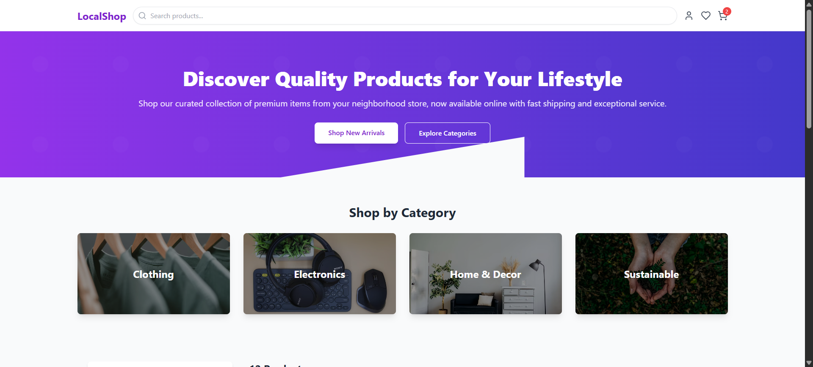

# E-commerce Store




This project is a fully functional e-commerce store application built with React and JavaScript. It features product listings, a shopping cart, and a wishlist, providing a comprehensive example of a modern web application.

## Table of Contents
- [Project Overview](#project-overview)
- [Features](#features)
- [Technologies Used](#technologies-used)
- [Installation](#installation)
- [Usage](#usage)
- [Project Structure](#project-structure)
- [Contributing](#contributing)
- [License](#license)

## Project Overview

The E-commerce Store is a single-page application designed to showcase a range of products with interactive shopping features. Users can browse products, add them to a shopping cart, manage quantities, save items to a wishlist, and proceed through a simulated checkout process. The application is built with React and styled using Tailwind CSS, ensuring a responsive and modern user experience.

## Features
- **Product Listings**: Display a variety of products with images, names, descriptions, and prices.
- **Shopping Cart**: Add, remove, and update quantities of items in the cart. View cart subtotal and proceed to checkout.
- **Wishlist**: Save favorite products to a personal wishlist for later viewing.
- **Product Filtering & Search**: Filter products by category and search by keywords.
- **Product Detail Pages**: Dedicated pages for each product with more detailed information.
- **Responsive Design**: Optimized for various screen sizes, from mobile devices to desktops.
- **Simulated Checkout**: A basic checkout flow to demonstrate order processing.

## Technologies Used
- **Frontend**: React.js
- **Styling**: Tailwind CSS
- **State Management**: React Context API (for global store state)
- **Routing**: React Router DOM
- **Icons**: Lucide React
- **Build Tool**: Vite

## Installation
To get a local copy up and running, follow these simple steps.

### Prerequisites
Make sure you have Node.js and npm (Node Package Manager) installed on your system.
- Node.js (LTS version recommended)
- npm (usually comes with Node.js)

### Steps
1. **Clone the repository (or extract the provided archive):**
   ```bash
   git clone <repository_url> # If applicable
   # or unzip ecommerce_javascript_converted.tar.gz
   ```
2. **Navigate to the project directory:**
   ```bash
   cd ecommerce_js_final
   ```
3. **Install dependencies:**
   ```bash
   npm install
   ```

## Usage
To run the development server and view the application in your browser:

```bash
npm run dev
```

The application will typically be available at `http://localhost:5173` (or another port if 5173 is in use).

## Project Structure
```
ecommerce_js_final/
├── public/
├── src/
│   ├── assets/ (e.g., images)
│   ├── components/
│   │   ├── Cart/
│   │   │   ├── CartItem.jsx
│   │   │   └── CartSidebar.jsx
│   │   ├── Layout/
│   │   │   ├── Footer.jsx
│   │   │   ├── Header.jsx
│   │   │   └── Layout.jsx
│   │   ├── Wishlist/
│   │   │   ├── WishlistItem.jsx
│   │   │   └── WishlistSidebar.jsx
│   │   ├── Filters.jsx
│   │   ├── ProductCard.jsx
│   │   ├── ProductGrid.njsx
│   │   └── SearchBar.jsx
│   ├── contexts/
│   │   └── StoreContext.jsx
│   ├── pages/
│   │   ├── Checkout.jsx
│   │   ├── Home.jsx
│   │   └── ProductDetail.jsx
│   ├── utils/
│   │   └── mockData.js
│   ├── App.jsx
│   ├── index.css
│   └── main.jsx
├── .gitignore
├── index.html
├── package.json
├── postcss.config.js
├── tailwind.config.js
└── vite.config.js
```

## Contributing
Contributions are welcome! If you find any issues or have suggestions for improvements, please open an issue or submit a pull request.
1. Fork the repository
2. Create a feature branch
3. Make your changes
4. Add tests if applicable
5. Submit a pull request

## License
Distributed under the MIT License. See `LICENSE` for more information. (Note: A `LICENSE` file is not included in this example, but would typically be present in a real project.)

---

🎓 Internship Program Prodigy InfoTech  
📅 Task 03 – Local Store E-commerce Platform
🚀 Intern Momen Kelany


